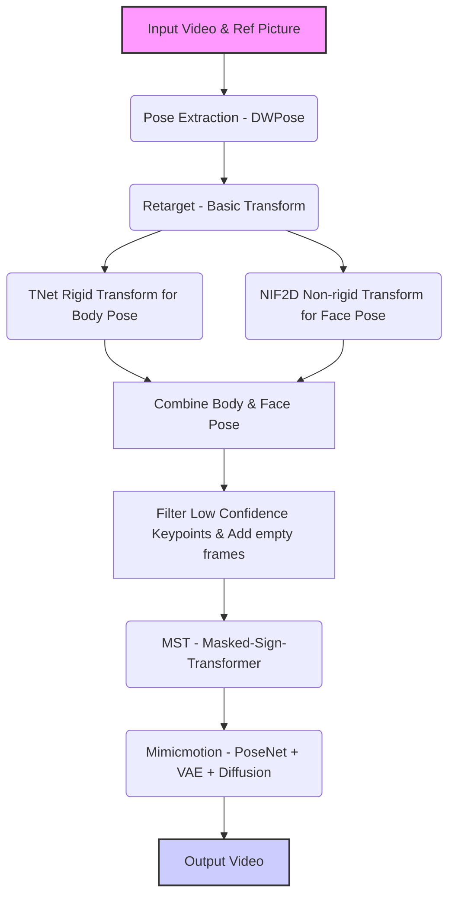

# UniSignMimic Project
## Intro

***
## Runs
***
## Modules
### Pose Extraction (DWPose)
### Retarget (Basic Transform)
### TNet Rigid Transform (for Body Pose)
### NIF2D Non-rigid Transform (for Face Pose)
### MST (Masked-Sign-Transformer)
### Mimicmotion (PoseNet + VAE + Diffusion)
